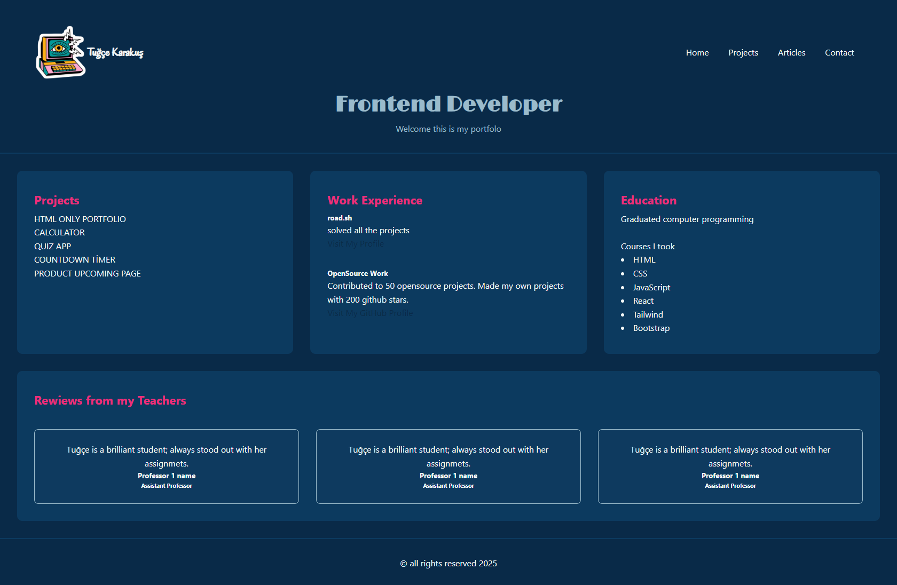

# 🌐 Personal Portfolio Website (Practice Project)

This is a responsive portfolio website built as part of the [roadmap.sh frontend project challenge](https://roadmap.sh/projects/portfolio-website). It was developed for learning and practice purposes using HTML and CSS only.

## 🛠️ Technologies Used

- HTML5  
- CSS3  
- Google Fonts

## Goal

Add styles to previous project. Focus on layout and responsive design.

## Requirements

- [X] Fully styled and responsive website
- [X] Consistent color scheme and typography
- [X] Use flexbox, media queries, and grid to create a responsive layout
- [x] Responsive navigation bar
- [ ] Well-styled contact form

Bonus:

- [X] Utilize Google Fonts
- [ ] Link to GitHub pages
- [ ] Add dark mode support
