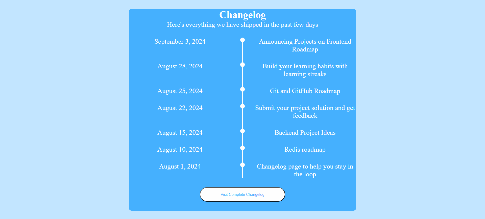

# Changelog Component

A simple and responsive **Changelog UI component** built as part of the [roadmap.sh Frontend Projects](https://roadmap.sh/projects/changelog-component).  
This project demonstrates how to create a timeline-style changelog using **HTML** and **CSS**.

---
## 📸 Demo

---

## 🚀 Features
- Clean and minimal design  
- Vertical timeline with changelog items  
- Responsive typography using `clamp()`  
- CSS variables for easy theme customization  
- Hover effects for interactive UI  
- Centered layout with equal spacing on all screens  

---

## 🛠️ Built With
- **HTML5** (semantic structure)  
- **CSS3** (Flexbox, CSS Variables, Responsive Units)

