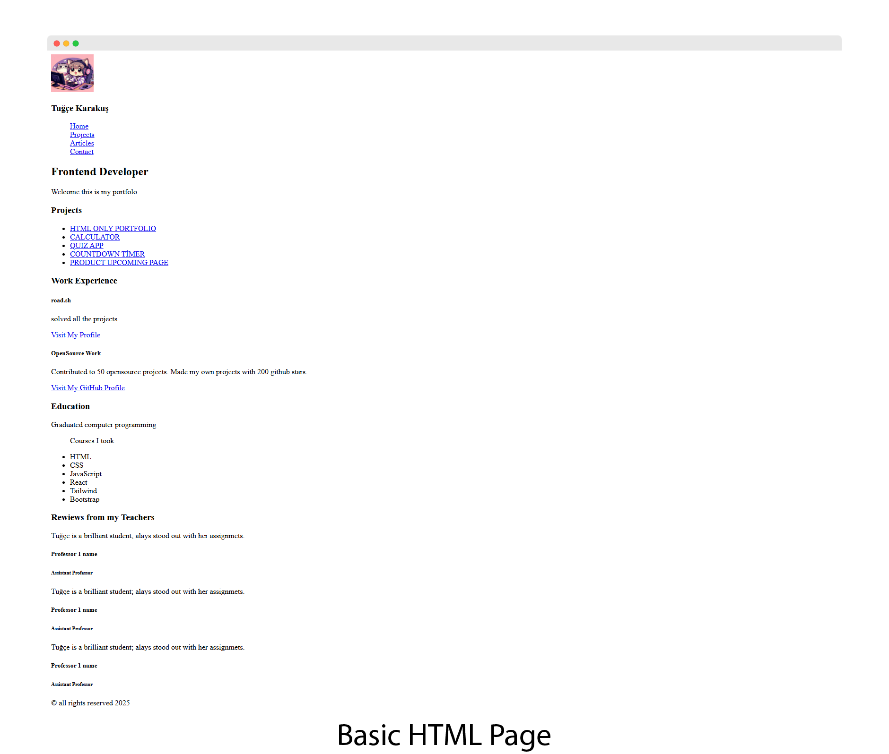

# Front-end Projects from Roadmap.sh
This repository contains front-end projects built following the [roadmap.sh](https://roadmap.sh/) front-end developer path.

## Projects List
[Single Page CV](https://roadmap.sh/projects/single-page-cv),
[Basic_HTML_Website](https://roadmap.sh/projects/basic-html-website),
[Personal Portfolio](https://roadmap.sh/projects/portfolio-website)

Click any image to view that solution.

