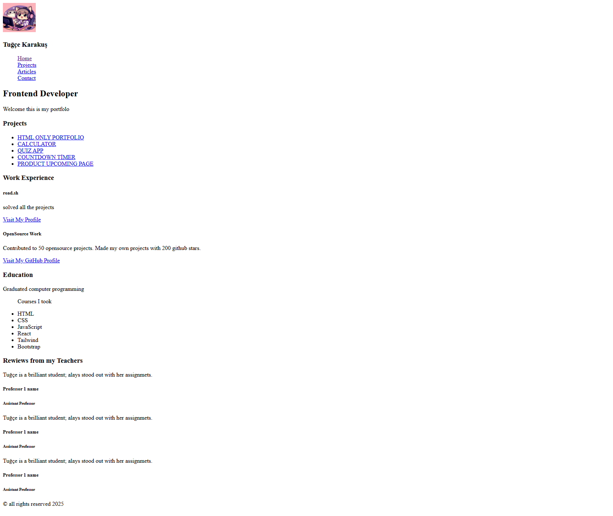

# Front-end Projects from Roadmap.sh

This repository contains front-end projects built following the [roadmap.sh](https://roadmap.sh/) front-end developer path.

## Projects List

- [Single Page CV](https://roadmap.sh/projects/single-page-cv)
- [Basic HTML Website](https://roadmap.sh/projects/basic-html-website)
- [Personal Portfolio](https://roadmap.sh/projects/portfolio-website)

## Demo Previews

Click any image to view that solution.

